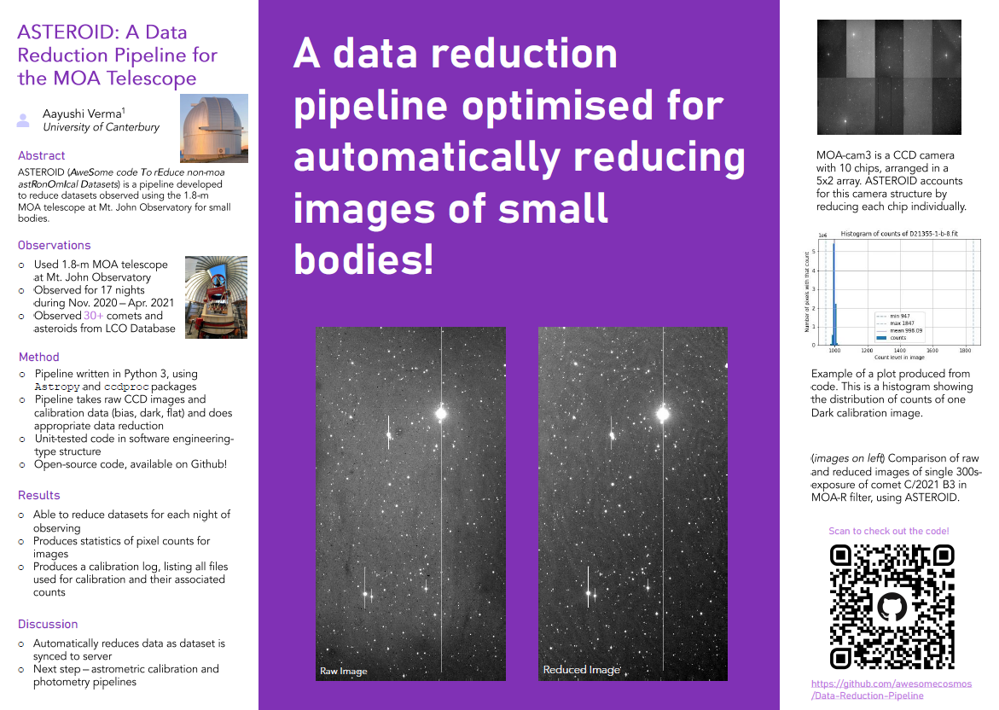

# ASTEROID (AweSome code To rEduce non-moa astRonOmIcal Datasets) - A Data Reduction Pipeline for Mt. John's 1.8-m Telescope

This GitHub repository contains all relevant files and outputs relating to this project, which is a data reduction pipeline for reducing datasets from the 1.8-m telescope at Mt. John Observatory.

**Developer:** Aayushi Verma 

**Develepment:** Mar. 2021 - current 

Poster presentation for this project, presented at Royal Astronomical Society of New Zealand (RASNZ) Annual Conference in July 2021.

<!--  -->
